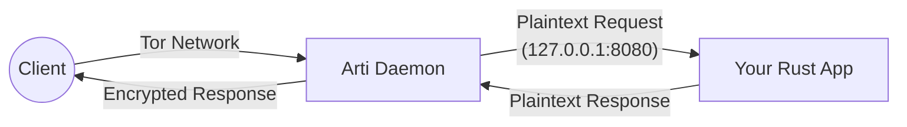

# Umbra Onion Services

**[📍 Back to Map](CONTENTS.md)**


> [!NOTE]
> **Onion Services** (formerly "Hidden Services") allow you to expose a local server (like a website or SSH) to the Tor network. They are end-to-end encrypted and anonymous. The server's IP address is never revealed to the client.

## 1. The Architecture

In the Umbra ecosystem, an Onion Service consists of two parts:

1.  **The Application (Content Provider)**
    *   This is your actual server (e.g., a Python web server, a Rust API, `sshd`).
    *   It listens on **Localhost** (e.g., `127.0.0.1:8080`).
    *   It **does not** know about Tor. It just serves local traffic.

2.  **The Proxy (Arti)**
    *   Arti acts as the "Sidecar".
    *   It creates the presence on the Tor network.
    *   It receives encrypted traffic from Tor, decrypts it, and forwards it to your **Application** on Localhost.



---

## 2. Configuration (The "Intent")

To create a service, you tell Arti: "Map a public port (80) on the onion network to my local port (8080)."

**File**: `umbra/etc/arti.toml`

```toml
[onion_services."my-secure-app"]
# The keys will be generated in: umbra/var/lib/arti/onion_services/my-secure-app/
proxy_ports = [
    # Public Port (Tor) -> Local Port (Application)
    [ 80, "127.0.0.1:8080" ],
    [ 22, "127.0.0.1:2222" ]
]
```

---

## 3. State (The Keys & Hostname)

Once you restart `arti` with the new config, it will automatically generate the cryptographic identity for your service.

**Location**: `umbra/var/lib/arti/onion_services/`

For a service named `my-secure-app`:
*   **Hostname**: `umbra/var/lib/arti/onion_services/my-secure-app/hostname`
    *   Contains the public address: `vtw...xyz.onion`
*   **Keys**: `hs_ed25519_secret_key` etc.
    *   **CRITICAL**: Never share or lose these keys. If lost, the onion address is gone forever.

---

## 4. Hosting & Tooling

Where should you build the actual applications?

### A. Simple Hosting (Static Sites / Tools)
For simple tools, run them as standard processes listening on localhost.
*   **Location**: `umbra/tools/` or `umbra/bin/`
*   **Example**: `python3 -m http.server 8080 --bind 127.0.0.1`

### B. Professional Rust Development (Recommended)
For robust services, we build proper Rust binaries.

**Recommended Stack:**
1.  **Web Framework**: **Axum** (Ergonomic, robust, by Tokio team).
2.  **Async Runtime**: **Tokio**.
3.  **Tor Integration**:
    *   **Standard**: Run your App + `arti` (System Daemon). Easiest to debug.
    *   **Embedded**: Use the `arti-client` Rust crate to run Tor *inside* your app process. (Advanced, cleaner deployment).

**Project Location**: `umbra/modules/`
Create new services here.
*   `umbra/modules/secure-chat-api/`
*   `umbra/modules/file-drop/`

### C. Vanity Addresses
If you want a custom address (e.g., `umbra...onion`), use `mkp224o` from `umbra/tools/`.
1.  Generate keys with `mkp224o`.
2.  Stop Arti.
3.  Overwrite the keys in `umbra/var/lib/arti/onion_services/my-service/`.
4.  Restart Arti.

---

## 5. Workflow Summary

1.  **Develop**: Write your HTTP/TCP service in `umbra/modules/`. Make it listen on `127.0.0.1:XXXX`.
2.  **Configure**: Edit `umbra/etc/arti.toml` to map Port 80 -> `127.0.0.1:XXXX`.
3.  **Deploy**: Run `start-arti` (or launch the daemon).
4.  **Connect**: Read the hostname file and connect via Tor Browser.