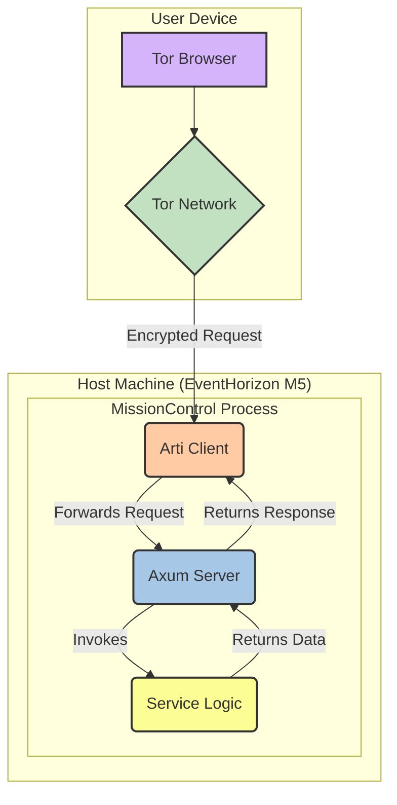

# MissionControl: High-Level Architecture

This document outlines the proposed architecture for the MissionControl Onion Service. The design prioritizes security, performance, and modularity.

## 1. Core Components

The system is composed of three main logical components. It is designed to be self-contained and relies *exclusively* on an Arti process for Tor network access, with no interaction with C-Tor.

1.  **Arti Client (`arti-client`):** The **sole** bridge to the Tor network. It is responsible for establishing a connection, launching the Onion Service, and routing incoming requests.
2.  **Axum Web Server (`axum`):** The application layer that handles incoming HTTP requests from the Tor network, processes them, and returns responses.
3.  **Service Logic:** The core business logic of the application, which gathers the data to be displayed (e.g., system metrics, DeFi portfolio status).



## 2. Technical Stack

*   **Language:** Rust (Stable)
*   **Async Runtime:** `tokio`
*   **Web Framework:** `axum`
*   **Tor Integration:** `arti-client`
*   **Serialization:** `serde`
*   **HTTP Utilities:** `tower-http` (for header stripping and static file serving)

## 3. "Zero-Leak" Architectural Principles

*   **Strict Localhost Binding:** The Axum server will be configured to bind *only* to `127.0.0.1`. It will be impossible to access the web service from the local network or any interface other than the loopback, which Arti will use.
*   **Header Stripping Middleware:** A `tower-http` layer will be implemented to intercept all outgoing responses and remove identifying headers like `Server` and `Date`. This mitigates server fingerprinting.
*   **Self-Contained Assets:** All CSS and JavaScript will be served directly by the Axum server. No third-party CDNs or external font providers will be used, preventing any client-side IP leakage.

## 4. Proposed `main.rs` Structure

```rust,ignore
use arti_client::{TorClient, TorClientConfig};
use axum::{routing::get, Router};
use std::net::SocketAddr;
use tokio::net::TcpListener;

// Main entry point
async fn main() -> Result<(), Box<dyn std::error::Error>> {
    // 1. Initialize Arti Tor Client
    // let config = TorClientConfig::default();
    // let tor_client = TorClient::create_bootstrapped(config).await?;

    // 2. Launch the Onion Service
    // let (onion_service, stream) = tor_client.launch_onion_service()?;
    // // The `stream` is a stream of incoming connections from the Tor network.

    // 3. Define the Axum Application
    let app = Router::new()
        .route("/", get(handler_root))
        .route("/metrics", get(handler_metrics));
        // Add header stripping middleware here

    // 4. Run the Axum Server, listening for connections from the Arti service stream
    // This part requires a custom 'hyper' executor that can process the stream
    // from arti_client instead of a standard TCP listener.
    // Research into `axum::serve` with a custom connection stream is needed.

    println!("MissionControl service running at: [onion_address].onion");

    Ok(())
}

// --- Axum Handlers ---
async fn handler_root() -> &'static str {
    "Welcome to MissionControl"
}

async fn handler_metrics() -> &'static str {
    "System Metrics Placeholder"
}
```
*Note: The integration between `arti-client`'s connection stream and `axum`'s server is a key research point. It may involve using `hyper` directly or a custom `Accept` implementation.*